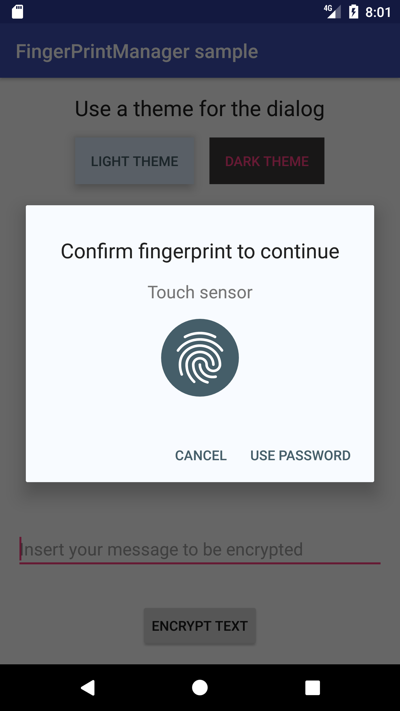
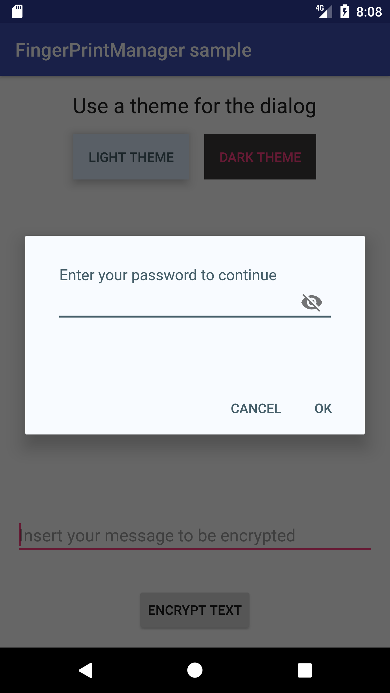
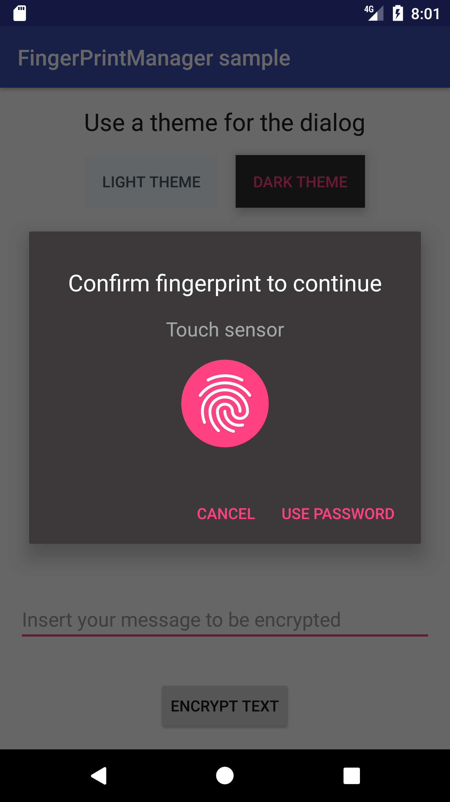
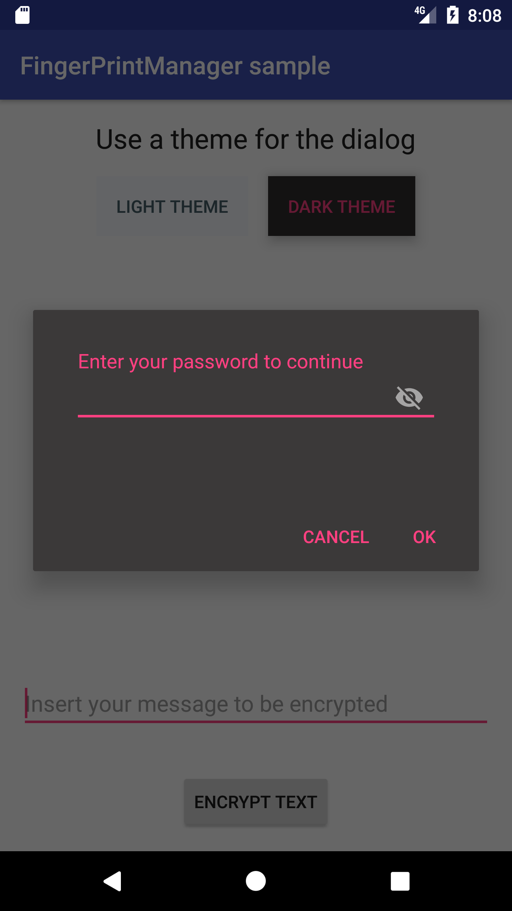

[](https://android-arsenal.com/details/1/5521)

[](https://dashboard.buddybuild.com/apps/5933de925161b7000159e901/build/latest?branch=master)

KFingerprintManager
-------------------
A small library to handle Android fingerprint APIs.
 
 This library offers an easy way to handle authorisation and encryption tasks using Android
 Fingerprint APIs. It's based on Android fingerprint dialog sample made by Google: 
 https://github.com/googlesamples/android-FingerprintDialog.

## Use

 This library can be used to provide basic authentication through fingerprint API, using manual password as backup option. It also allows you to encrypt messages using fingerprint APIs.
 This library provides a sample to show how it can be used.
 
 [](https://jitpack.io/#JesusM/FingerprintManager)

### Basic use:
 You import via gradle from <https://jitpack.io> adding this to your root build.gradle file:
 ```gradle
  allprojects {
    repositories {
      ...
      maven { url 'https://jitpack.io' }
    }
  }
 ```
 and then adding the library as dependency:
 ```gradle
 dependencies {
   compile 'com.github.JesusM:FingerprintManager:{latest_version}'
 }
 ```
 (you can see which is the {latest_version} value from [releases tab](https://github.com/JesusM/FingerprintManager/releases))
 
 Create the fingerprint manager.
 ```java
 fingerPrintManager = KFingerprintManager(context, key);
 ```

 `key` is the name for the symmetric key that is created in the Android Key Store. KFingerprintManager.InitialisationCallback contains a set of method that are called whether the fingerprint is ready to be used or when there is any error (like no fingerprint has been enrolled yet, or if there has been a problem initialising it).

 Once the library is ready to be used, it provides two features: authentication and encryption.

#### Authentication
 Authentication provides the simplest way to authenticate a user. Once it uses its fingerprint scanner, you'll obtain enough information to allow any operation that requires a user authentication.
 The library API is pretty simple, just call `startAuthentication` method passing to it a callback that will let you know the result of the operation. If the authentication went ok, you'll obtain a `CryptoObject` object that will let you use for authentication operations (see [encryption](#encryption) to see what you can do with that data)

 Logic to authenticate using fingerprint: 

  ```kotlin
    fingerPrintManager.authenticate(object : KFingerprintManager.AuthenticationCallback {
        override fun onAuthenticationFailedWithHelp(help: String?) {
            // Logic when decryption failed with a message
        }

        override fun onAuthenticationSuccess() {
            // Logic when authentication has been successful
        }

        override fun onSuccessWithManualPassword(password: String) {
            // Logic when authentication has been successful writting password manually
        }

        override fun onFingerprintNotRecognized() {
            // Logic when fingerprint was not recognized
        }

        override fun onFingerprintNotAvailable() {
            // Logic when fingerprint is not available
        }

        override fun onCancelled() {
            // Logic when operation is cancelled by user
        }
    }, getSupportFragmentManager());
  ```

#### Encryption/Decryption

  Encryption/decryption operations will be only done using fingerprint APIs, so if fingerprint is not present or suitable, it will fail.

  Logic to encrypt an String message using the library:
  ```kotlin
    fingerPrintManager.encrypt(messageToBeEncrypted, object : KFingerprintManager.EncryptionCallback {
        override fun onFingerprintNotRecognized() {
            // Logic when fingerprint was not recognized
        }

        override fun onAuthenticationFailedWithHelp(help: String?) {
            // Logic when decryption failed with a message
        }

        override fun onFingerprintNotAvailable() {
            // Logic when fingerprint is not available
        }

        override fun onEncryptionSuccess(messageEncrypted: String) {
            // Logic to handle the encrypted message
        }

        override fun onEncryptionFailed() {
            // Logic to handle decryption failure
        }

        override fun onCancelled() {
            // Logic when operation is cancelled by user
        }
     }, getSupportFragmentManager());
  ```

  Logic to decrypt an already encrypted message:

  

  ```kotlin
    fingerPrintManager.decrypt(messageToDecrypt, object : KFingerprintManager.DecryptionCallback {
        override fun onDecryptionSuccess(messageDecrypted: String) {
            // Logic that handles successful decryption result
        }

        override fun onDecryptionFailed() {
            // Logic to handle decryption failure
        }

        override fun onFingerprintNotRecognized() {
            // Logic when fingerprint was not recognized
        }

        override fun onAuthenticationFailedWithHelp(help: String?) {
            // Logic when decryption failed with a message
        }

        override fun onFingerprintNotAvailable() {
            // Logic when fingerprint is not available
        }

        override fun onCancelled() {
            // Logic when operation is cancelled by user
        }
     }, getSupportFragmentManager());
  ```

### Customisation:

The library allows you to customise how the visual component is displayed. In order to do that, you can follow these steps:

 1.- Declare a xml them like this:

  ```xml
    <style name ="DialogThemeLight" parent="Theme.AppCompat.Light.Dialog.MinWidth">
        <item name="colorAccent">@color/dialog_light_theme_accent</item>
        <item name="android:colorAccent">@color/dialog_light_theme_accent</item>
        <item name="android:background">@color/dialog_light_theme_background</item>
        <item name="android:textColorPrimary">@color/dialog_light_theme_text_color_primary</item>
        <item name="android:textColorSecondary">@color/dialog_light_theme_text_color_secondary</item>
    </style>
  ```

  2.- Once you have the theme, the library provides a method to set it:
   ```kotlin
   fingerPrintManager.setAuthenticationStyle(theme);
   ```

In the [screenshots](#screenshots) section you can see some samples of the customisations.

# Screenshots:

##### Authentication using fingerprint and manual password using a light theme.




<br><br>

##### Same screens but this time using a dark theme.





### Resources
 - Android Fingerprint Authentication: https://developer.android.com/about/versions/marshmallow/android-6.0.html#fingerprint-authentication


### License
MIT License

Copyright 2016 The Android Open Source Project, Inc.

Copyright (c) 2017 Jesús

Permission is hereby granted, free of charge, to any person obtaining a copy
of this software and associated documentation files (the "Software"), to deal
in the Software without restriction, including without limitation the rights
to use, copy, modify, merge, publish, distribute, sublicense, and/or sell
copies of the Software, and to permit persons to whom the Software is
furnished to do so, subject to the following conditions:

The above copyright notice and this permission notice shall be included in all
copies or substantial portions of the Software.

THE SOFTWARE IS PROVIDED "AS IS", WITHOUT WARRANTY OF ANY KIND, EXPRESS OR
IMPLIED, INCLUDING BUT NOT LIMITED TO THE WARRANTIES OF MERCHANTABILITY,
FITNESS FOR A PARTICULAR PURPOSE AND NONINFRINGEMENT. IN NO EVENT SHALL THE
AUTHORS OR COPYRIGHT HOLDERS BE LIABLE FOR ANY CLAIM, DAMAGES OR OTHER
LIABILITY, WHETHER IN AN ACTION OF CONTRACT, TORT OR OTHERWISE, ARISING FROM,
OUT OF OR IN CONNECTION WITH THE SOFTWARE OR THE USE OR OTHER DEALINGS IN THE
SOFTWARE.
